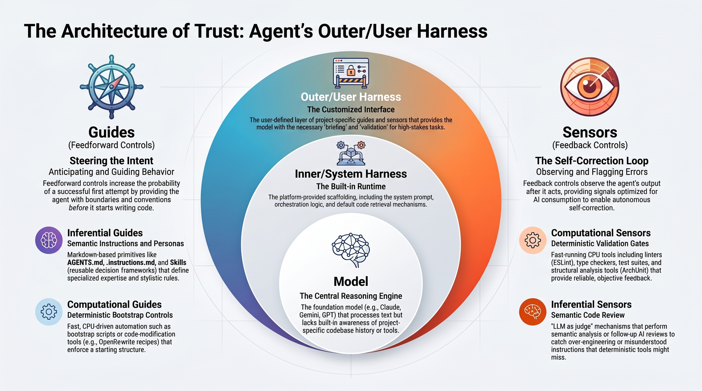

# AI/R Harness Setup

_Configurando um Outer Harness na prática._

O agente de código começa cada conversa sabendo só o que os documentos do projeto dizem a ele. Se ninguém escreveu os comandos, as convenções e o que não se pode tocar, ele adivinha, e você corrige o mesmo erro na semana seguinte.

Neste hands-on você muda isso: instala um **Outer Harness** feito para o projeto, valida cada documento e vê o agente seguir o que vocês escreveram.

## Conheça o `air-harness-setup`

O `air-harness-setup` é a skill que instala o Outer Harness junto com você, numa sessão só para isso. Depois, você volta a trabalhar no código como sempre.

- 🔍 **Lê o projeto e pergunta só o que falta.** README, manifests, CI e a documentação que você indicar. "Não sei" também é resposta: vira uma lacuna marcada.
- ✍️ **Gera cada documento sob medida.** O pacote traz templates e um exemplo fictício como referência. Nada é copiado para o projeto.
- ✅ **Você aprova tudo.** Cada documento chega como rascunho e só é gravado depois do seu sim. Nada do que o projeto já tem é sobrescrito.
- 🤖 **Funciona com o agente que você já usa:** Claude Code, Kiro, GitHub Copilot ou AI/C Reasoning, com as instruções em português ou inglês.

  

O Outer Harness é a camada de <em>guides</em>: orienta o agente antes de ele agir. Sensores e gates, que verificam depois, são a camada seguinte.

## O que você leva deste hands-on

- **Um `AGENTS.md` com a cara do projeto.** É a espinha que o agente lê em toda conversa: comandos, convenções, segurança e armadilhas conhecidas.
- **Rules sob medida.** O agente só as carrega quando o assunto aparece, seja uma área do código ou um tipo de tarefa.
- **O loop de feedback.** Quando o agente erra, você ajusta o documento, e não só o código, para o erro não voltar.
- **Um roteiro para repetir no seu squad.** O mesmo pacote serve para os outros projetos.

## Como funciona

1. **Montar a pasta-mãe.** Baixe o pacote do seu agente e extraia ao lado do código, nunca dentro.
1. **Gerar a espinha.** A skill entrevista você e propõe o `AGENTS.md`. Você ajusta e aprova.
1. **Aprovar rules.** Escolha pelo menos uma das rules candidatas e valide.
1. **Usar e ajustar.** Faça uma tarefa real com o agente e leve o que aprendeu de volta ao documento.

Cada passo chega numa issue do seu repositório. A cada push na `main`, uma verificação automática responde nessa issue e libera o passo seguinte. Você faz no seu ritmo.

## Antes de começar

- **Para quem é:** AI Champions e desenvolvedores que vão levar o Outer Harness aos projetos dos seus squads.
- **Você vai precisar de:** Git, uma conta GitHub com acesso à organização AIR-Modern-Studio, acesso à [página do Outer Harness](https://airportal.sharepoint.com/sites/ai-adoption/ai-champions/SitePages/Outer-Harness.aspx) no site AI Champions (é de lá que vem o pacote) e um dos quatro agentes instalado.
- **Onde:** na sua máquina, com o repositório clonado.

## Comece agora

Copie o exercício para a sua conta como repositório **privado**, espere **uns 20 segundos** e **atualize a página**. As instruções vão aparecer numa issue do seu repositório.

Está com problemas?
 

- Crie a cópia como **privada**: o projeto-base é interno.
- Se a issue não aparecer em 20 segundos, abra a aba [Actions](../../actions) e veja se o job ainda está rodando.
- Se um job falhou, avise quem está conduzindo o hands-on.

